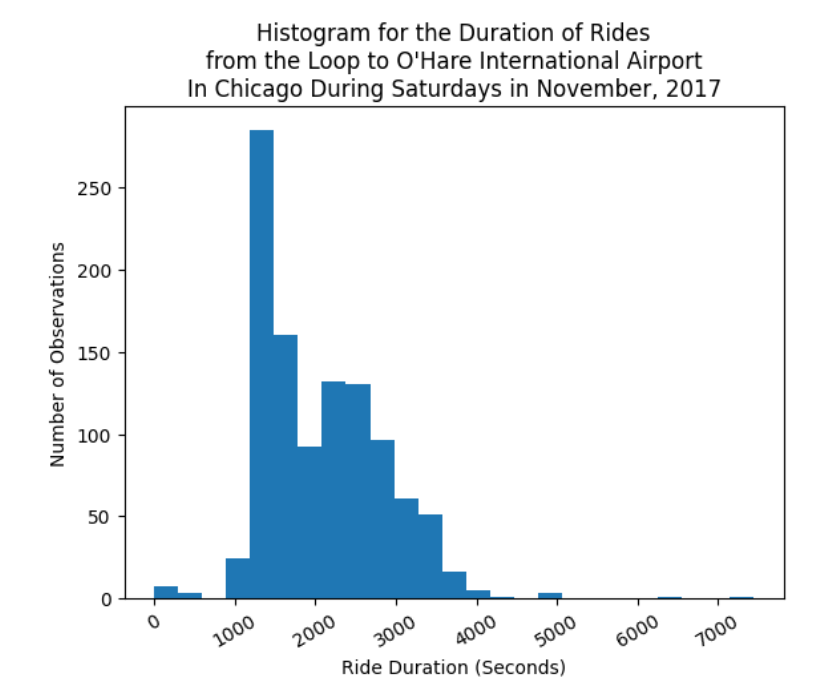
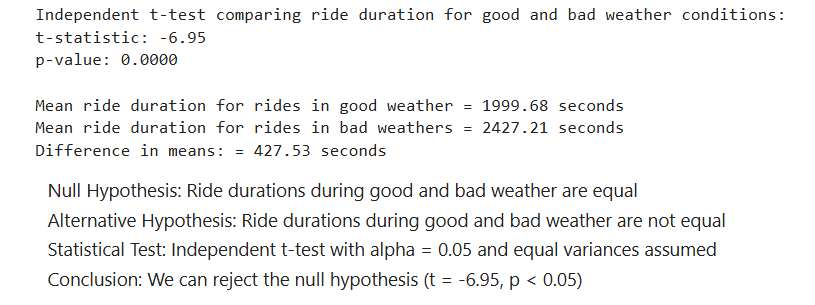

# Sprint 6 Project: Data Collection and Storage (SQL)
 
---

### 📚 Table of Contents
- 🔍 [Project Overview](#project-overview)
- 📈 [Conclusion](#conclusion)
- 🖼️ [Sample Outputs](#sample-outputs)
- 📁 [Files](#files)

---

## Project Overview

You're working as an analyst for Zuber, a new ride-sharing company that's launching in Chicago. Your task is to find patterns in the available information. You want to understand passenger preferences and the impact of external factors on rides.

Working with a database, you'll analyze data from competitors and test a hypothesis about the impact of weather on ride frequency.

---

## Conclusion

The data provides some insight into the behavior of taxi passengers in Chicago during November, 2017. Rides were disproportionately concentrated in four neighborhoods (the Loop, River North, Streeterville, and West Loop) and one taxi company (Flash Cab). The distributions of rides for companies and neighborhoods were very right skewed with the top 10 representing a majority of rides in both cases. That means Zuber should focus on only a few hotspots and competitors. I would advise them to concentrate on downtown Chicago and try to cut into Flash Cab's market share.

Rain and other bad weather conditions were significantly associated with longer rides from the Loop to O'Hare airport on Saturdays. Zuber could perhaps mention inclement weather in ads to solicit those longer rides or maybe increase prices during the rain to capitalize on them.

---

## Sample Outputs

Here are two key moments from the analysis:

  
*Distribution of taxi ride durations from the Loop to O'Hare on Saturdays in November 2017. Most rides lasted between 1,000 and 3,000 seconds.*

 

  
*Rides during bad weather were significantly longer on average — about 7 minutes more than rides in good weather (t = –6.95, p < 0.05).*

---

## Files

📄 See the full analysis in [`sprint-06-project.ipynb`](./sprint-06-project.ipynb)  
📄 Or view a static version in [`sprint-06-project.html`](./sprint-06-project.html)  
📄 Project background: [`project-description.md`](./project-description.md)

> Note: This project uses three CSV files, all of which are included in the `/data/` folder.  
> See [`/data/README.md`](./data/README.md) for details.
